<!-- 

  

<h2 align="center">
💻 Tech Stack
</h2> -->

   
   
   
   
  
   
   
  
  
  
   
  
   
  
   
   
   
  
  
    
  
   
  
   
   
  
  
   
   
   
   
   
   
  
  
   

  

<!-- 

  
<h4 align="center">
  📊 GitHub Stats
  </h2>

  
  <h2 align="center">
  📊 GitHub Stats
  </h2>
  
  

    
  

  
   
   
  

 -->
